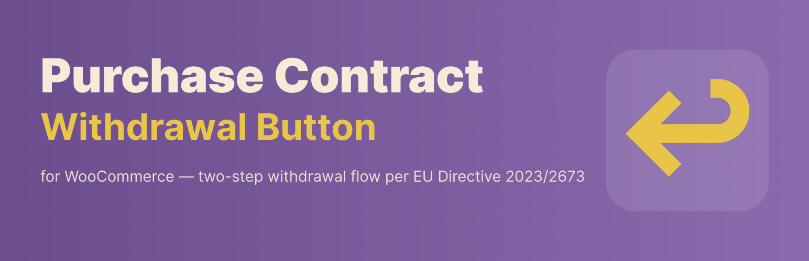
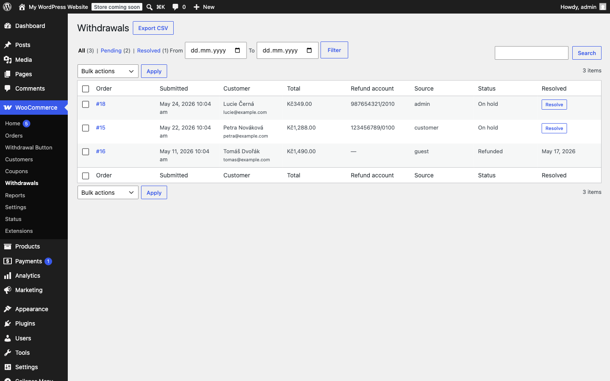
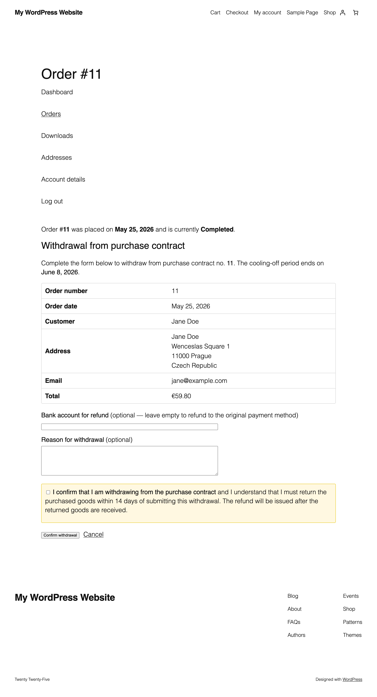
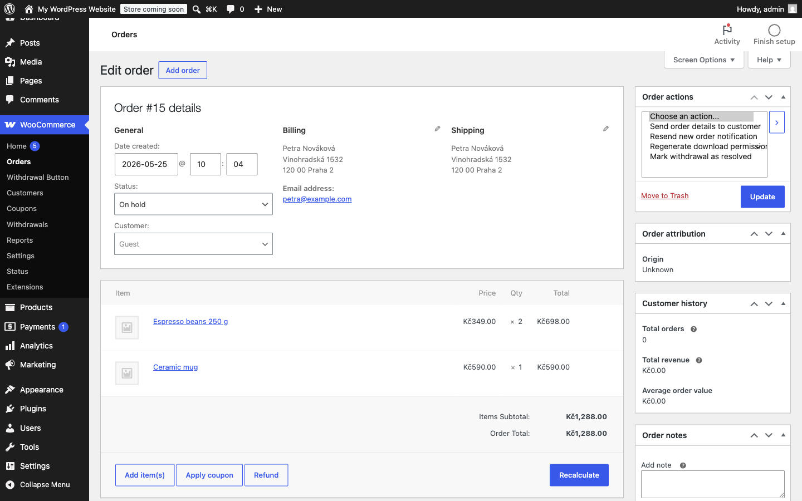

# Purchase Contract Withdrawal Button for WooCommerce

A WooCommerce plugin that adds a customer-facing "Withdraw from purchase contract" button to the My Account order detail page, with a two-step submission flow, configurable cooling-off period, and automated email confirmation.

Designed to help merchants comply with **EU Directive 2023/2673** — which requires online merchants to provide consumers with a direct online function to withdraw from a contract. In the Czech Republic this is enforced from **19 June 2026** under § 1830a of the Civil Code ("button amendment 2.0"). Equivalent transposition is required across all EU member states.

## Features

- Textual button ("Withdraw from purchase contract") on the order detail page in My Account
- Two-step submission: button → review form → explicit confirmation
- Configurable cooling-off period (default 14 days, counted from order completion)
- Configurable eligible order statuses (default: `completed`)
- Configurable post-submission status (default: `on-hold`)
- Customer + admin emails as native `WC_Email` classes — customizable in WooCommerce → Settings → Emails
- Theme-overridable templates in `/templates/`
- Fully translatable (English source, Czech + Slovak bundled)
- HPOS-compatible

## Installation

1. Download the latest release ZIP.
2. Upload via WordPress → Plugins → Add New → Upload Plugin.
3. Activate.
4. Configure at **WooCommerce → Withdrawal Button**.

## Filters and actions

| Hook | Type | Purpose |
|------|------|---------|
| `pcwb_period_days` | filter | Override cooling-off period |
| `pcwb_eligible_statuses` | filter | Override list of eligible order statuses |
| `pcwb_new_status` | filter | Order status applied after submission |
| `pcwb_admin_recipient` | filter | Admin email recipient |
| `pcwb_after_submit` | action | Fires after a successful withdrawal: `($order, $reason, $account)` |

## Screenshots

### Customer view — button on the order detail page

### Customer view — withdrawal form

### Admin view — settings page

## Disclaimer

This plugin is not legal advice. Merchants remain responsible for ensuring their full implementation (terms and conditions, refund processing, goods return) complies with applicable law.

## License

GPLv2 or later. See [LICENSE](LICENSE).
